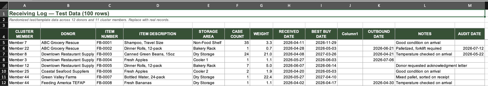
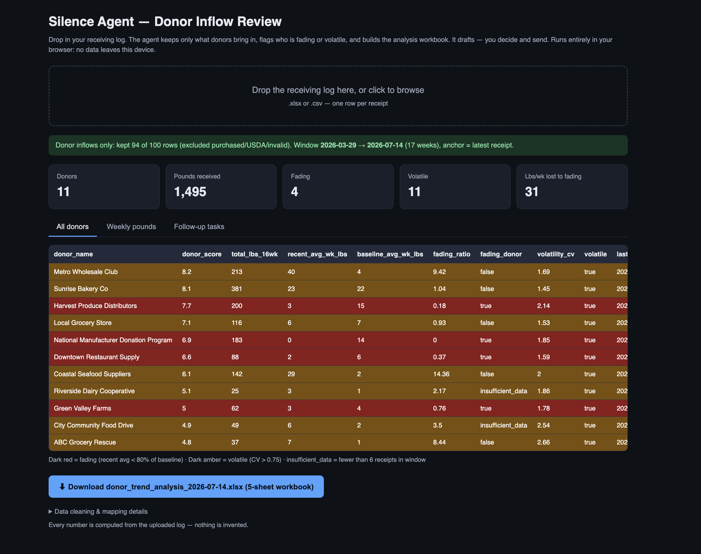
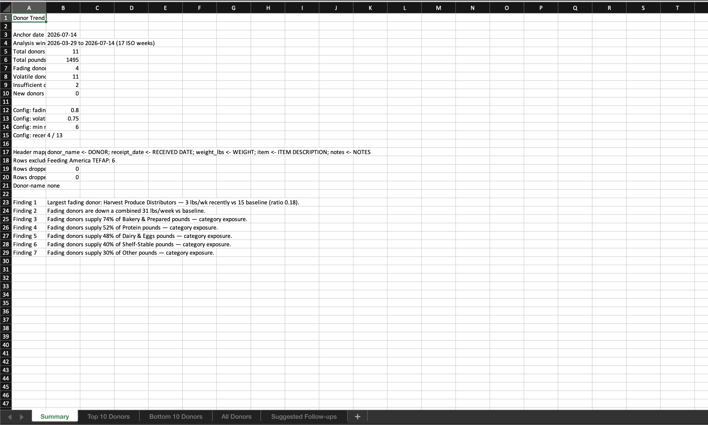
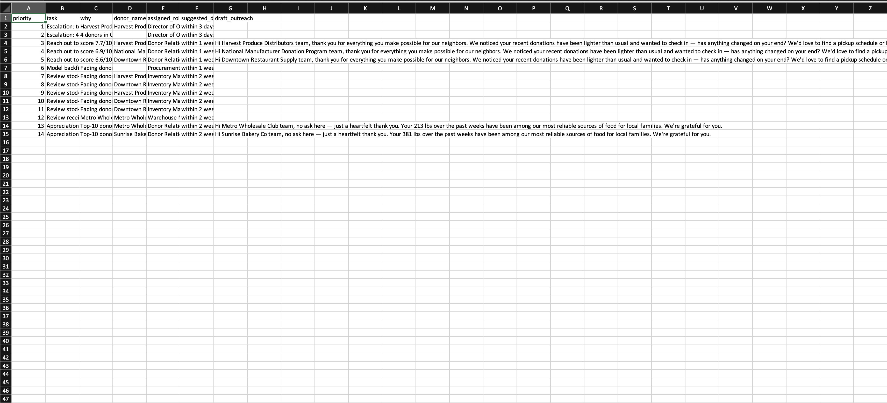

# The Silence Agent — Donor Inflow Review

A donor-reliability agent for food banks — catching quiet donor decline before it becomes a cash problem.

When donations quietly fade, food banks fill the gap with purchased food at spot prices. The Silence Agent watches the receiving log, scores every donor, flags who is fading or volatile, and drafts the follow-up — the agent drafts, a human decides and sends.

**Note:** The current receiving log template received is built for the [Food Bank Contra Costa/Solano](https://www.foodbankccs.org)

**Live app:** upload your receiving log (.xlsx or .csv, one row per receipt) and everything runs in your browser. No server, no database — **no data ever leaves your device.**

## How it works

Directly access from my github pages [link](https://n-trahan.github.io/silence_agent/)

Drop in the receiving log:



The agent keeps only donor inflows (purchased and USDA/TEFAP loads are excluded automatically), builds a 16-week analysis window anchored to the latest receipt, and scores every donor on consistency, amount, quality, and variety:



- **Dark red = fading** — recent 4-week average below 80% of the 12-week baseline
- **Dark amber = volatile** — week-to-week coefficient of variation above 0.75
- **insufficient_data** — fewer than 6 receipts in the window (never flagged, never ranked)

## The deliverable: a 5-sheet Excel workbook

One click exports `donor_trend_analysis_<date>.xlsx` — Summary, Top 10 Donors, Bottom 10 Donors, All Donors, and Suggested Follow-ups:



Follow-up tasks are prioritized and routed to the right desk (Director of Operations, Donor Relations, Procurement, Inventory, Warehouse), with outreach emails already drafted:



## Features

- **Format-tolerant ingestion** — auto-detects the header row and maps varied column names (`Source/Donor` or `DONOR`, `Date Received` or `RECEIVED DATE`, ...); merges duplicate donor-name spellings
- **Donor inflows only** — purchased, USDA/TEFAP/CSFP, and invalid rows are excluded and reported
- **Fading & volatility detection** — recent-vs-baseline ratio and CV per donor, with traps handled: a donor switching to biweekly double-loads is *not* flagged
- **Weekly trend charts** — per-donor weekly pounds and top donors by volume
- **Drafted outreach** — check-in and appreciation emails ready to review and send
- **Blind-tested** — on a sealed answer key: all 5 injected fading/stopped donors caught, 0 missed, 0 false positives

## Run it

Hosted on GitHub Pages, or locally:

```
python3 -m http.server 8000
```

then open http://localhost:8000

## Repo contents

| File | Purpose |
|---|---|
| `index.html` | UI — upload, metrics, tabs, charts, workbook export |
| `analyzer.js` | Analysis engine — header mapping, cleaning, scoring, flagging, follow-ups |
| `screenshots/` | Images used in this README |

---

*Built by Nicole Trahan & Karen for the AISCO Hackathon, July 2026. Every number is computed from the uploaded log — nothing is invented.*
